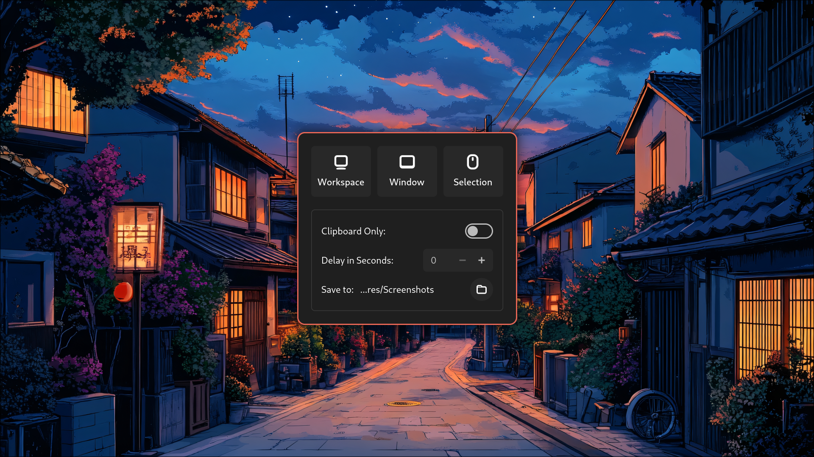

<h1 align="center">Hyprshot GUI</h1>

<p>A simple GTK4-based application for taking screenshots, utilizing <b>Hyprshot</b> under the hood. The design is inspired by <b>GNOME Screenshot</b>.</p>

## Features
- Easy-to-use GTK4 interface
- Uses **Hyprshot** for capturing screenshots
- Lightweight and fast

## Interface Preview


## Dependencies
Ensure you have the following dependencies installed before running the application:

- **Python 3** (minimum required version)
- **python-gobject**
- **GTK4**
- **Hyprshot**

## Installation
Run the provided installation script to install all the dependencies and set up the application:

```bash
git clone https://github.com/s-adi-dev/hyprshot-gui.git
cd hyprshot-gui
./install.sh
```
---
**Note**: The install script is only for **Arch Linux** users. If you are using a different distribution, you need to manually install the required dependencies. After installing the dependencies, you must copy or move the `./src/hyprshot-gui` file to the `/usr/bin/` directory so that it can be executed from anywhere in the terminal.  

Additionally, to integrate **Hyprshot** into your system’s application menu (so it appears in app launchers like `rofi`, `wofi`, or `dmenu`), you need to place the `.desktop` file in `/usr/share/applications/`.  

To do this, run:  

```bash
sudo cp ./src/hyprshot-gui /usr/bin/hyprshot-gui
sudo cp ./src/hyprshot.desktop /usr/share/applications/hyprshot.desktop
```

## Usage
Once installed, you can launch the app from your applications menu or via the terminal:

```bash
hyprshot-gui
```

## Configurations
Hyprshot GUI provides two ways to configure its behavior: **configuration file** and **command-line flags**.

### 1. Configuration File
You can create a configuration file at `~/.config/hypr/hyprshot.conf` to persist your settings. If the file does not exist, Hyprshot GUI will generate it with default values on the first run.

#### Example Configuration File
```ini
[Settings]
OutputDir=~/Pictures
Delay=0
NotifyTimeout=5000
ClipboardOnly=False
Freeze=False
Silent=False
```

#### Available Settings
| Setting         | Type    | Description                                      | Default Value  |
|----------------|---------|--------------------------------------------------|----------------|
| `OutputDir`    | String  | Directory where screenshots are saved           | `~/Pictures`   |
| `Delay`        | Integer | Delay before taking a screenshot (in seconds)  | `0`            |
| `NotifyTimeout`| Integer | Notification timeout duration (in milliseconds) | `5000`         |
| `ClipboardOnly`| Boolean | Save screenshot only to clipboard               | `False`        |
| `Freeze`       | Boolean | Freeze the screen on initialization             | `False`        |
| `Silent`       | Boolean | Suppress notifications when saving a screenshot | `False`        |

#### Notes:
- `Boolean` values accept `True`, `False`, `1`, or `0`.
- `OutputDir` supports `~` expansion.

### 2. Command Line Options
You can override the configuration file settings using command-line flags when launching Hyprshot GUI.

| Flag | Alias | Description |
|------|-------|-------------|
| `-h` | `--help` | Show help message and exit |
| `-v` | `--version` | Show version information and exit |
| `-o <path>` | `--output-folder <path>` | Set directory to save screenshots |
| `-z` | `--freeze` | Freeze the screen on initialization |
| `-d <seconds>` | `--delay <seconds>` | Set delay before taking a screenshot |
| `--clipboard-only` | | Save only to clipboard |
| `-s` | `--silent` | Do not send notification when a screenshot is saved |
| `-t <ms>` | `--notify-timeout <ms>` | Set notification timeout in milliseconds |

#### Example Usage
```sh
hyprshot-gui -o ~/Screenshots -d 3 --clipboard-only
```

Command-line options take precedence over configuration file settings for that session.


## Additional Configuration
For a better user experience, you can configure Hyprland to launch the application in floating mode by adding the following window rule to your Hyprland configuration:
```bash
windowrulev2 = float, title:^(.*Hyprshot.*)$
```
## Contributing
If you'd like to contribute, feel free to submit pull requests or report issues.

## License
This project is licensed under the [MIT License](./LICENSE).

